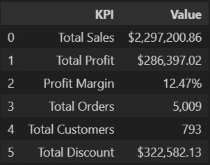
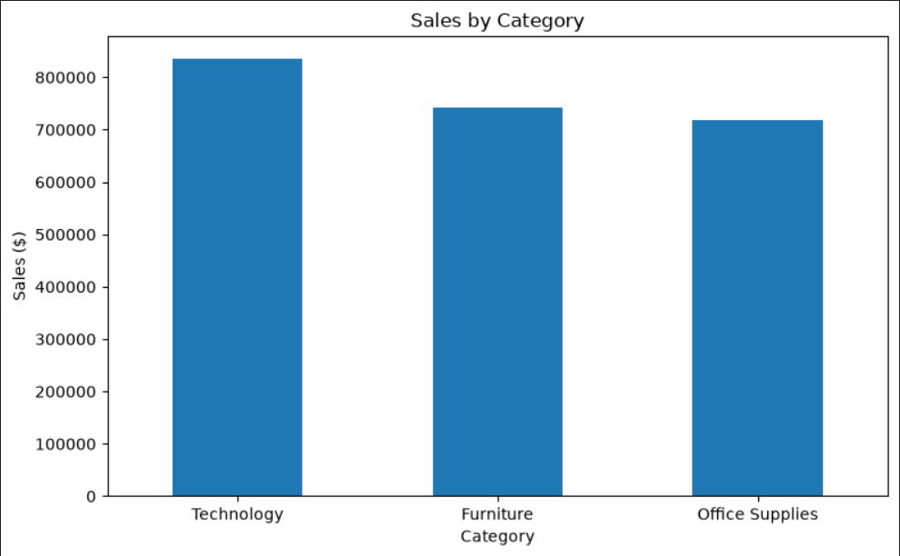
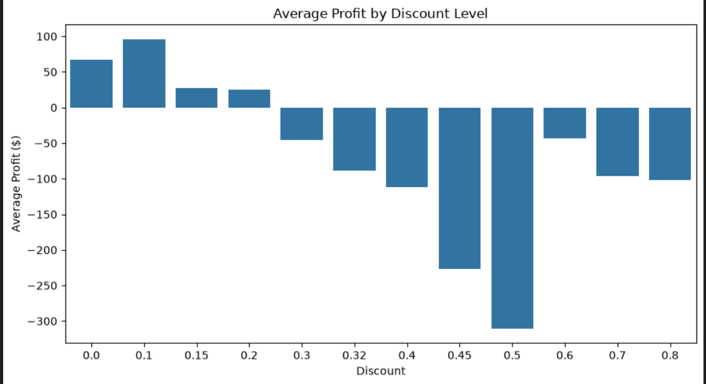
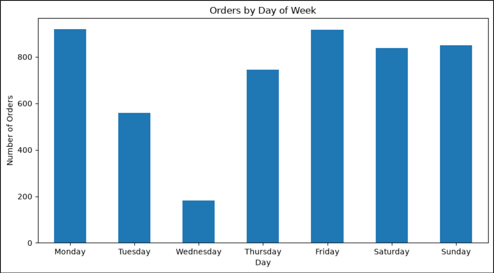

# 🛒 Superstore Sales Analysis

## 📌 Project Overview

An exploratory data analysis project using Python to analyze sales, profitability, customer behavior, regional performance, and order trends from the Superstore dataset.

The project focuses on identifying key business patterns and generating actionable insights from sales data using data cleaning, exploratory analysis, statistical analysis, and data visualization.

## 🎯 Business Objective

The objective of this project is to analyze Superstore sales data and answer key business questions related to:

- 📊 **Sales Performance:** Which categories, regions, cities, and segments generate the most sales?
- 💰 **Profitability:** How do discounts and order quantities relate to profit?
- 👥 **Customers:** Which customers contribute the most sales?
- 📅 **Time Trends:** How do sales and orders vary across different dates and days of the week?
- 💡 **Business Insights:** What patterns can help improve sales and profitability?

## 🛠️ Tools & Technologies

- 🐍 **Python:** Data analysis and visualization
- 🐼 **Pandas:** Data cleaning, transformation, and analysis
- 🔢 **NumPy:** Numerical calculations
- 📊 **Matplotlib:** Data visualization
- 📈 **Seaborn:** Statistical visualization
- 📓 **Jupyter Notebook:** Analysis environment
- 🐙 **Git & GitHub:** Version control and project documentation

## 📂 Dataset

The project uses the **Sample - Superstore** dataset containing **9,994 sales records** across **21 columns**.

The dataset contains information about:

- 🛍️ **Orders:** Order dates, order IDs, quantities, sales, discounts, and profits
- 👥 **Customers:** Customer names, customer IDs, and segments
- 📦 **Products:** Categories and sub-categories
- 🗺️ **Locations:** Regions, states, cities, and postal codes
- 🚚 **Shipping:** Ship modes and shipping dates

### 🔗 Dataset Source

The dataset was obtained from **Kaggle** and is used for educational and portfolio analysis purposes.

## 🧹 Data Preparation

Before performing the analysis, the dataset was checked and prepared for analysis:

- 🔍 **Missing Values:** No missing values were found.
- 🔄 **Duplicates:** No duplicate rows were found.
- 📅 **Date Formatting:** Date columns were converted to the appropriate datetime format.
- 🔢 **Data Types:** Columns were inspected to ensure appropriate data types.
- 📊 **Categorical Data:** Unique values and category distributions were explored.
- ⚠️ **Profit Values:** Negative profit values were retained because they represent loss-making transactions and are important for profitability analysis.

## 📊 Key Performance Indicators

| KPI | Value |
|---|---:|
| 💰 Total Sales | $2,297,200.86 |
| 💵 Total Profit | $286,397.02 |
| 📈 Profit Margin | 12.47% |
| 🧾 Total Orders | 5,009 |
| 👥 Total Customers | 793 |



These KPIs provide a high-level overview of the overall sales performance and profitability of the business.

## 📈 Analysis & Key Findings

### 🛍️ Sales Performance



- 🏆 **Top Category:** Technology generated the highest sales at approximately **$836K**.
- 🗺️ **Top Region:** The West region recorded the highest sales at approximately **$725K**.
- 🏙️ **Top City:** New York City generated the highest city-level sales at approximately **$256K**.
- 🏢 **Top Segment:** Consumer was the largest segment by sales at approximately **$1.16M**.

### 💰 Profitability & Discounts



- 💸 **Discount Impact:** Discount and profit showed a negative correlation of approximately **-0.22**, indicating that higher discounts generally tend to be associated with lower profits.
- ⚠️ **High Discounts:** Several higher discount levels resulted in negative average profits, suggesting that aggressive discounting can reduce profitability.
- 📦 **Quantity vs Profit:** Quantity showed only a weak positive relationship with profit, with an order-level correlation of approximately **0.12**. Selling more units alone does not necessarily result in higher profit.

### 👥 Customer Performance

- 🥇 **Top Customer:** Sean Miller generated the highest sales at approximately **$25K**.
- 👥 **Customer Base:** The dataset contains **793 unique customers**.

### 📅 Time Analysis



- 📈 **Highest Sales Day:** March 18, 2014 generated approximately **$28.1K** in sales.
- 📆 **Order Pattern:** Monday recorded the highest number of unique orders, followed closely by Friday.
- 📉 **Lowest Activity:** Wednesday had the lowest number of unique orders.
- 🎉 **Festival Analysis:** Festival-specific effects were not analyzed because the dataset does not contain a dedicated festival or holiday indicator.

## 🎯 Business Recommendations

Based on the analysis, the following actions could help improve sales performance and profitability:

- 💸 **Review High Discounts:** Higher discount levels were associated with lower average profitability. The business could review high-discount orders and consider setting discount limits or approval thresholds.

- 🛍️ **Focus on Strong Categories:** Technology generated the highest sales. Maintaining product availability and targeted marketing for high-performing products could help sustain this performance.

- 🗺️ **Investigate Regional Gaps:** The South region generated substantially lower sales than the West and East. Further analysis of customer demand, product mix, and market coverage could identify growth opportunities.

- 👥 **Strengthen Customer Retention:** High-value customers contribute significantly to overall sales. Targeted retention strategies could help maintain relationships with valuable customers and identify similar customer profiles for acquisition.

## 📁 Project Structure

```text
Superstore-Sales-Analysis/
│
├── notebooks/
│   └── Superstore_Sales_Analysis.ipynb
│
├── images/
│   └── Project visualizations
│
├── data/
│   └── Sample - Superstore.csv (local only)
│
├── README.md
└── .gitignore
```

## 📚 Dataset Source

The dataset used in this project is the **Sample - Superstore** dataset, obtained from Kaggle.

The dataset is used for educational and portfolio analysis purposes.

## 👤 Author

**Himanshu Rawat**

Aspiring Data Analyst skilled in SQL, Excel, Power BI, and Python.

- 💻 **GitHub:** [GitHub Profile](https://github.com/himanshurawat3399-create)
- 📧 **Email:** himanshurawat3399@gmail.com
